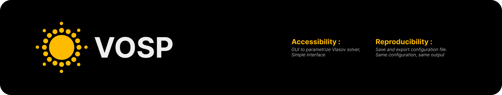
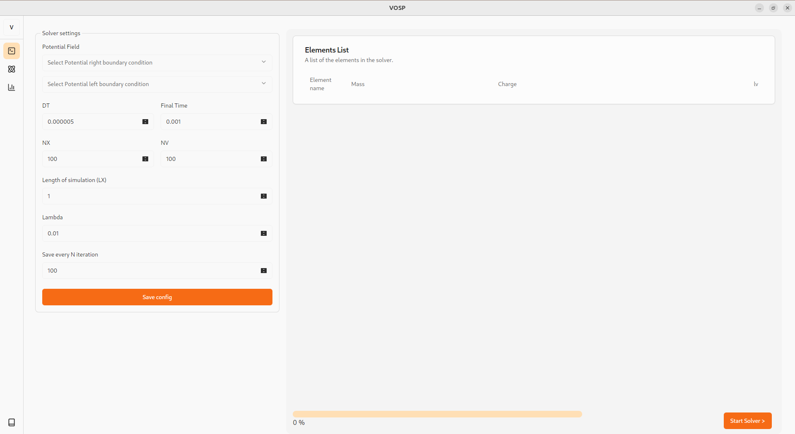
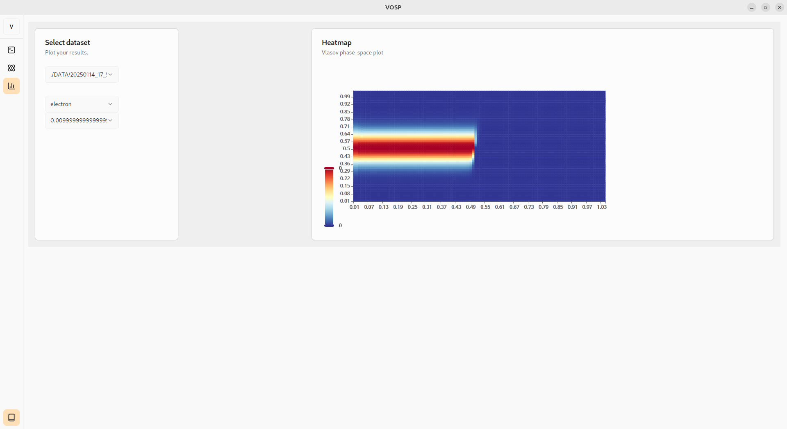

## Introduction
This project is a solver of the Vlasov Equation built with rust and Tauri. The focus during the development was put on the accessibility and the correctness of the code. VOSP stands for (Vlasov Open Source Project). It takes benefit of operator splitting to create a powerful, polyvalent and easy to use Vlasov solver. VOSP can handle multiple species with different types of collisions. And is currently suited for simulating complex chemistry inside a vlasov simulation

## [Documentation](https://randomusernametosave.github.io/VOSP-GUIDE)
The documentation is accessible here : https://randomusernametosave.github.io/VOSP-GUIDE. The details of the implementation and scheme used are described there.

## Examples
### Solver window
The solver window helps you configure the parameters of the solver (such as the time step, and the spatial and velocity resolution).

### Data Window 
The data window helps you quickly display the results of your solver.

## Getting started
To get started, download the binaries on the "releases" tab in github.
Install and start VOGUI.
