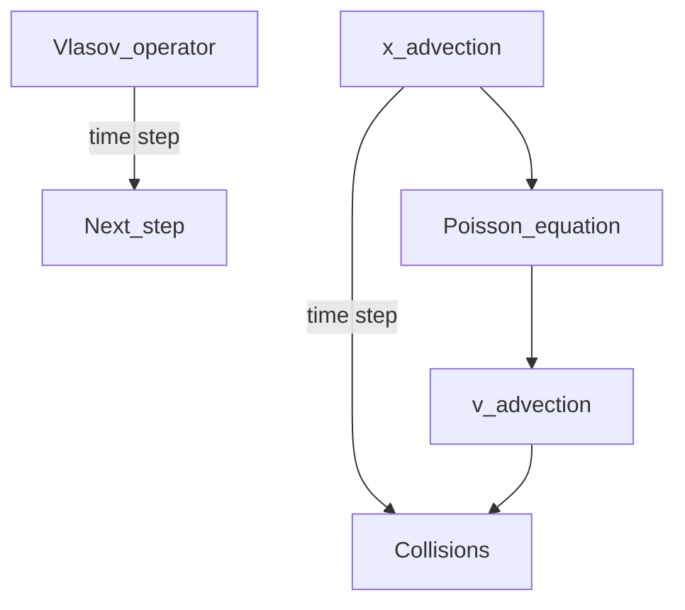

This project is a solver of the Vlasov Equation built with rust and Tauri. The focus during the development was put on the accessibility and the correctness of the code.

## Numerical methods
The Vlasov equation is an equation used in plasma physics. It is given by the following equation, where "s" denote the species "s". And $\hat C_{s,s'}$ denote the collision operator between species "$s$" and "$s'$".
```math
\partial_t f_s + \vec v \partial_x f_s + \frac{q_s}{m_s} \: \vec E \: \partial_v f_s = \sum_{s'} \hat C_{s,s'}
```

The space of the solution lies in the phase space $(\vec x , \vec v)$ which means that the space of the solution is at least 2 dimensional, and at best 6 dimensional (3 space, 3 velocity). For the moment, the code only works in 1D-1V.

A solver of the Vlasov-Equation is therefore computationally expensive. Moreover, more often than not there exist a huge difference of kinetics between at least two species. The CFL stability condition is therefore a big problem of the Vlasov-Equation. Hence, the methods described below will not suffer this stability condition. However, the time discretization error is still in $O(\Delta t ^2)$. The user will therefore have to find a compromise between time step and calculation.

### Operator splitting

The operator splitting (or "time splitting" in plasma physics) is a numerical method that transform the equation into simpler problem to solve. 
With operator splitting, one will solve first advection along space axis, then advection along velocity axis, and finally collisions. All those steps represents therefore one time step. This operator splitting comes with a cost of a time discretization error in $O(\Delta t ^2)$ (higher order schemes also exist). 

Operator splitting will be useful when adding different types of collisions and to gain more flexibility for the solver.


### Semi-Lagrangian

Thanks to operator splitting, solving Vlasov-Equation boils down to solving different advection step (respectively $\partial_t f_s = -v \partial_x f_s $, and $\partial_t f_s = -E \partial_v f_s $).
Semi-Lagrangian method (SL) takes advantage of the explicit solution of the advection equation.
Indeed, v and E being constants along respectively x and v axis, the solution of those equations take the form given below.
```math
f_s(x,v,t) = f_s(x-v \Delta t ,v,t - \Delta t) 
```
Therefore, given a point $(x,v,t)$, the goal is to reconstruct the point at $(x-v \Delta t ,v)$ at previous time step. Different polynomial reconstructions exist, we then chose to use a CWENO-3.2 polynomial reconstruction to prevent Gibbs phenomenom close to discontinuity.

